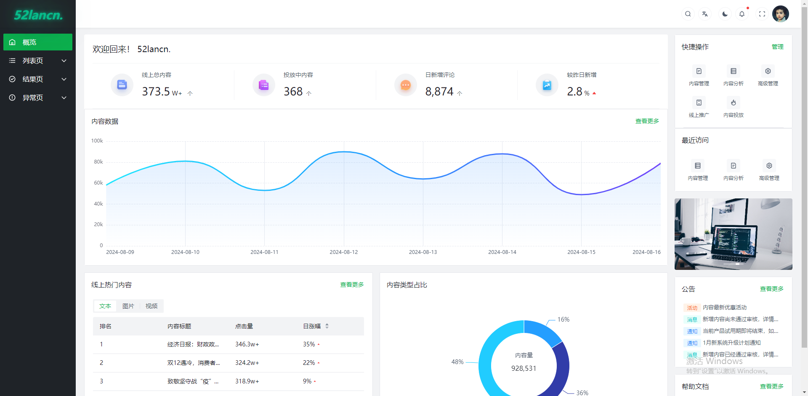

# vue-admin

仅个人学习实践项目，请勿用于生产。

基于 [Arco Design Vue](https://arco.design/)  组件库的开箱即用的中后台前端解决方案。




## 使用

```shell
$ git clone https://github.com/52lancn/vue-admin.git
$ cd vue-admin
$ pnpm i
$ pnpm run dev
```
